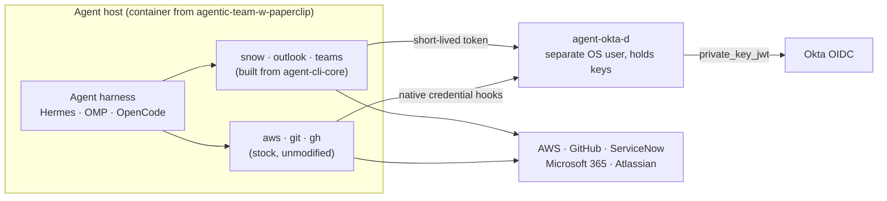

# agentic-teams

**The root of a set of repositories that let autonomous SDLC agents work as real, attributable
teammates.** This repository is documentation only. It is the map: what each repository is for, how
they fit together, and where each one lives. The repositories themselves are independent and are
**not** checked into this one.

See [INTENT.md](INTENT.md) for the purpose and [AGENTS.md](AGENTS.md) for the rules agents and
contributors follow here.

## The repositories

| Repository | Language | What it is | Status |
|---|---|---|---|
| [agentic-team-w-paperclip](https://github.com/stainedhead/agentic-team-w-paperclip) | Dockerfiles, shell, CI | Baseline container images carrying the Hermes, OMP and OpenCode harnesses, with Paperclip as the orchestration plane, plus the docs and templates to configure and deploy them | Exists |
| [agent-okta-d](https://github.com/stainedhead/agent-okta-d) | Go | Credential daemon. Okta OIDC is the identity root; it serves short-lived credentials to `aws`, `git`, `gh` and the CLIs below, so the agent never holds a long-lived secret | Exists (PRD, scaffold; no code yet) |
| [snow-cli](https://github.com/stainedhead/snow-cli) | Go | `snow`: task-shaped ServiceNow CLI for work items and CMDB lookups, for agents and humans | Exists (PRD, scaffold; no code yet) |
| [outlook-cli](https://github.com/stainedhead/outlook-cli) | Go | `outlook`: read, triage and send mail as the agent's own Entra user | Exists (PRD, scaffold; no code yet) |
| [teams-cli](https://github.com/stainedhead/teams-cli) | Go | `teams`: post and read Teams messages as the agent's own Entra user | Exists (PRD, scaffold; no code yet) |
| `agent-cli-core` | Go module | Shared auth, policy, output, audit and HTTP packages for `snow`, `outlook` and `teams` | Planned; location undecided |

`agent-cli-core` has no repository yet, so it is not linked. When it is created, add its link here and
update the table in [AGENTS.md](AGENTS.md). The four Go repositories currently hold a PRD and a
scaffold only.

## How the pieces fit



## Using the set
Clone the root, then clone the repositories you need beside its files. They land in the directories
this repository's `.gitignore` already ignores:

```bash
git clone https://github.com/stainedhead/agentic-teams.git
cd agentic-teams
git clone https://github.com/stainedhead/agentic-team-w-paperclip.git
git clone https://github.com/stainedhead/agent-okta-d.git   # likewise snow-cli, outlook-cli, teams-cli
```

Each repository carries its own README, history and CI. Work inside the one you are changing and
commit there.

## What is committed here
Only `README.md`, `INTENT.md`, `AGENTS.md`, `CLAUDE.md`, `.gitignore`, `.github/` and `docs/`.
